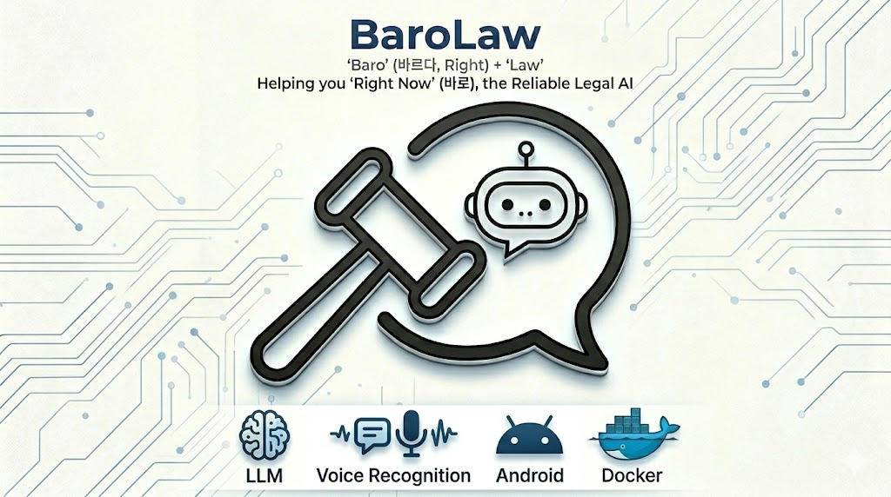
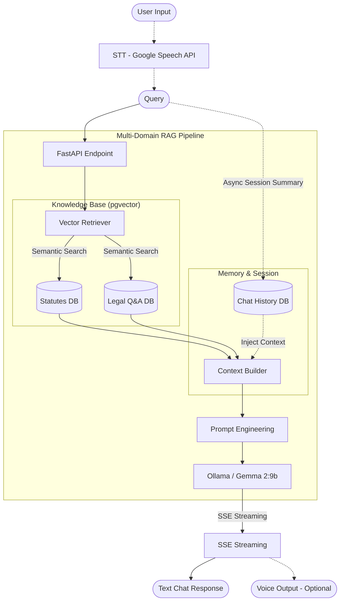
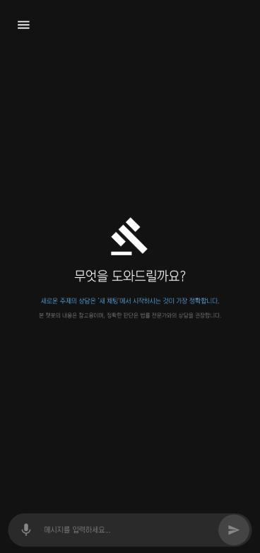
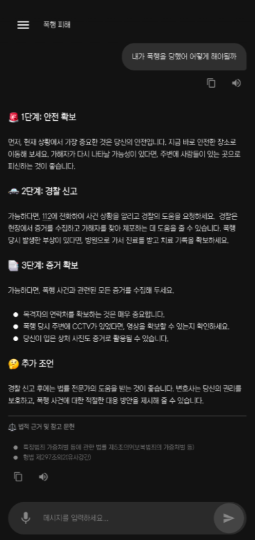
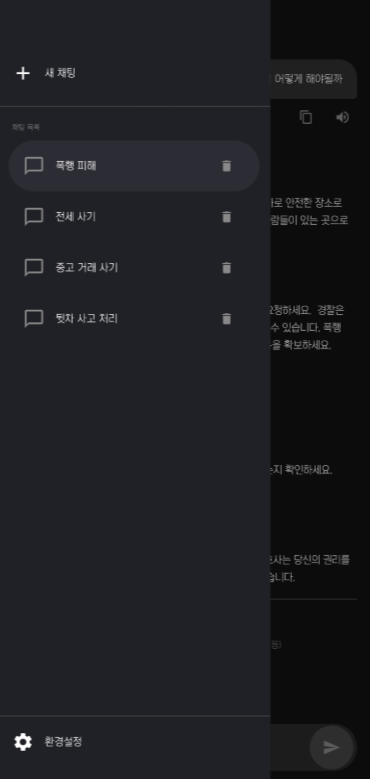

# ⚖️ BaroLaw (바로Law): 당신의 손안에 있는 법률 비서

> **"바르다(Right)"** + **"Law"** = 언제든 **"바로(Right Now)"** 도움을 주는 법률 상담 AI 서비스

  

## 🌟 프로젝트 개요

**BaroLaw**는 복잡한 법률 문제를 빠르고 정확하게 해결할 수 있도록 돕는 **AI 법률 상담 챗봇**입니다.

이름의 유래처럼, 법률 정보를 **'바르게'** 정제하여 사용자에게 **'바로(지금 당장)'** 전달하는 것을 목표로 합니다. 특히, 편리한 **음성인식(STT) 및 음성합성(TTS) 인터페이스**를 결합하여 사용자가 어떤 상황에서도 손쉽게 법률 상담을 시작하고 음성으로 안내받을 수 있도록 설계되었습니다.

실제 대한민국 법령과 전문가 Q&A 데이터를 기반으로 실질적인 행동 요령을 제시하며, AI의 한계인 환각 현상을 기술적으로 통제하여 신뢰할 수 있는 법률 비서 대행 서비스를 제공합니다.

## 🛠️ 서비스 파이프라인 (Service Pipeline)

BaroLaw는 **Advanced Multi-Domain RAG** 아키텍처를 기반으로 설계되었습니다. 질의응답 과정에 음성 인터페이스를 직관적으로 결합하여 사용자 편의성을 극대화했습니다.

## ✨ 핵심 기능 (Key Features)

- **📚 멀티-도메인 하이브리드 RAG:** 7,000여 개의 법령 조문과 1,000건 이상의 실제 생활법률 상담 사례(Q&A)를 분리된 벡터 공간에서 동시에 탐색하여 지식의 사각지대를 최소화합니다.

- **🛡️ 100% 투명한 법적 근거:** AI가 자의적으로 법을 해석하거나 꾸며내는 현상을 막기 위해, 시스템이 검색한 백엔드 RAG 결과물만을 답변 하단에 `⚖️ 법적 근거 및 참고 문헌` 섹션으로 강제 결합합니다.

- **💬 프롬프트 엔지니어링 기반 멀티턴:** 사용자의 질문이 불충분할 경우 질문을 통해 추가 정보를 유도하거나, 단계별 해결책을 제시하며 논리적인 상담을 이어가는 지능형 멀티턴 인터랙션을 지원합니다.

- **📂 지능형 멀티턴 세션 관리:** 
   - 🤖 **AI 자동 요약:** 첫 발화 시, 메인 스트리밍 성능을 저하하지 않는 '지연 비동기 처리(Delay Async)' 기법으로 대화방 제목을 백그라운드에서 요약하여 DB에 반영합니다.
   - 🔄 **상태 보존 및 격리:** PostgreSQL 기반의 세션 격리 아키텍처를 통해, 과거 대화가 새로운 질문의 컨텍스트를 오염시키지 않도록 체계적으로 통제합니다.

## 📱 앱 동작 화면 (Preview)

| 메인 가이드 화면 | AI 상담 스트리밍 | 세션 관리 서랍 | 환경설정 (음성 제어) |
| :---: | :---: | :---: | :---: |
|  |  |  |  |

## 🚀 향후 계획 (Future Plans)

- **🔎 AutoRAG 시스템 도입:** 하이퍼파라미터 자동 최적화 프레임워크를 도입하여, 법률 도메인 특화 성능(Top-K, Chunking 전략 등)을 정교하게 튜닝할 예정입니다.

- **🔐 사용자 계정 및 동기화:** `ANDROID_ID` 기반 식별을 넘어, 이메일 가입 시스템을 통해 여러 기기에서도 내 대화 내역을 안전하게 유지하고 관리할 수 있도록 개선합니다.

- **🚥 백엔드 큐잉(Queuing) 시스템:** 다중 사용자의 대량 요청 시 LLM 엔진의 병목 현상을 방지하고, 응답 우선순위를 관리하기 위한 메시지 큐 시스템을 도입할 계획입니다.

## 📜 상세 기술 사양 (Technical Specs)

### **사용 모델 (AI Models)**
- **LLM Engine:** `Gemma 2:9b Instruct` (Ollama 호스팅)
- **Embedding Model:** `ko-sroberta-multitask` (768 Dimensions)
- **STT (Speech-to-Text):** Android `SpeechRecognizer` (Google Engine)
- **TTS (Text-to-Speech):** Android `TextToSpeech` (Korean Voice Engine)

### **Stack**
- **Frontend & App:** Kotlin, Jetpack Compose, Material Design 3, OkHttp(SSE Streaming)
- **Backend API:** Python, FastAPI, SQLAlchemy, httpx
- **Database:** PostgreSQL 16 (pgvector)
- **Infrastructure:** Docker, Docker Compose, ngrok

---
© 2026 BaroLaw Team. All rights reserved.
